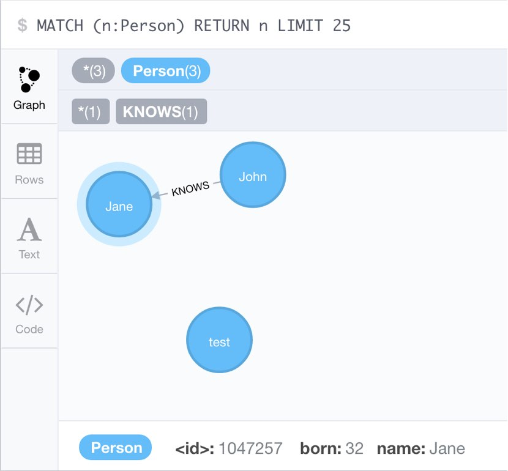

atomist-spring-neo4j microservice
===========================

Originally created on 2016-10-04.

Example Project demonstrating Atomist for Spring Boot with Neo4j

To run locally
--------------

This Spring Boot microservice is driven using Maven. To run locally simply execute the following from the command line:

```shell
> ./mvnw spring-boot:run
```

To run tests
------------

This microservice comes with some rudimentary tests as a good starting point for writing your own. Use the following command to execute the tests using Maven:

```shell
> ./mvnw test
```

There is a single Person entity, which has `name` and `born` properties and a `KNOWS` relationships that's mapped to a `friends` field.

Person is exposed through 3 controller methods for listing, creating people and for adding friends.

By default, Spring Data Neo4j connects to a local Neo4j server running on http://localhost:7474
You **have to** configure your password in `application.properties`.



---
Created by Atomist. Need Help? <a href="https://join.atomist.com/">Join our Slack team</a>
